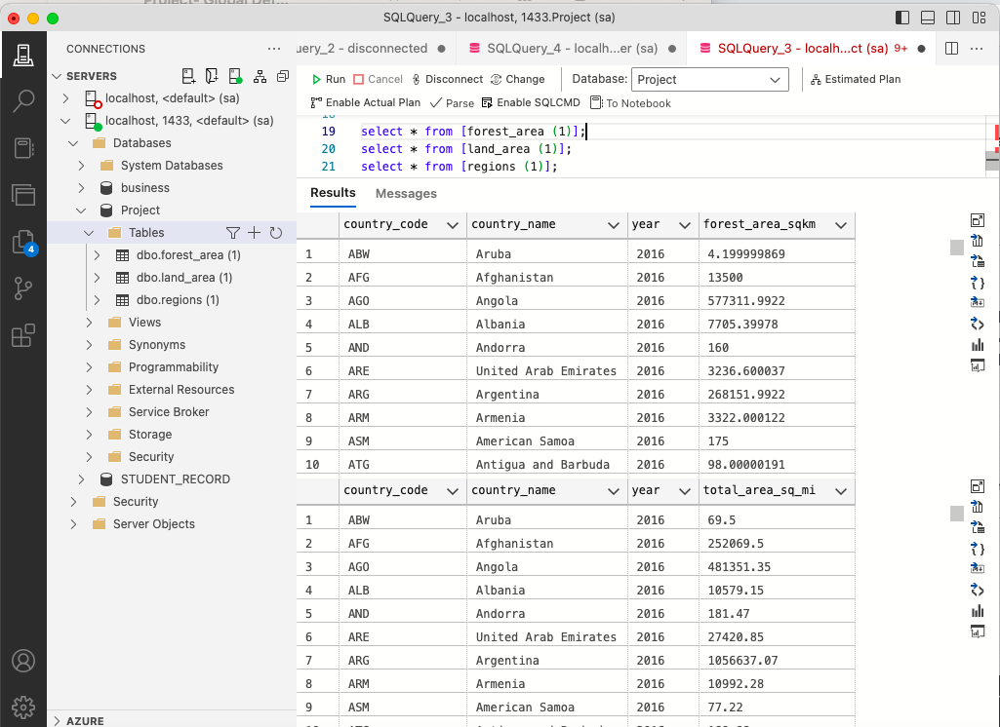
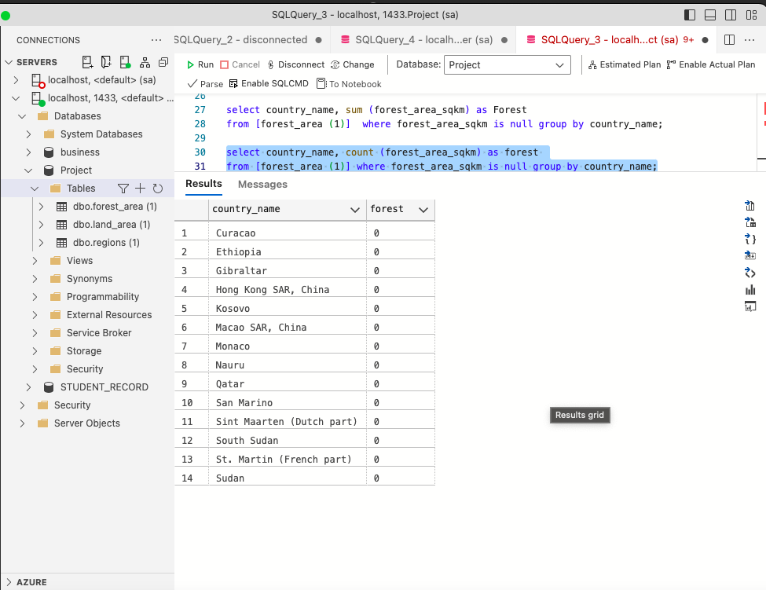
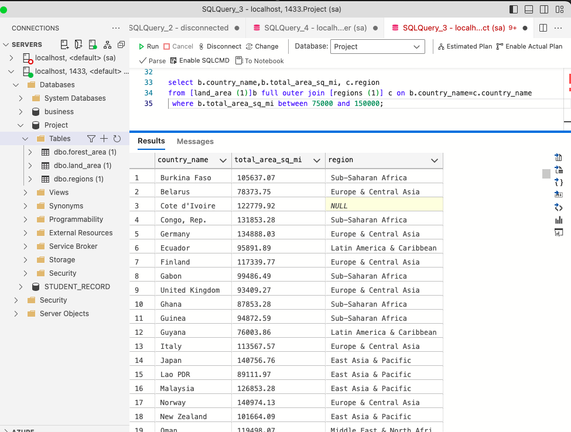
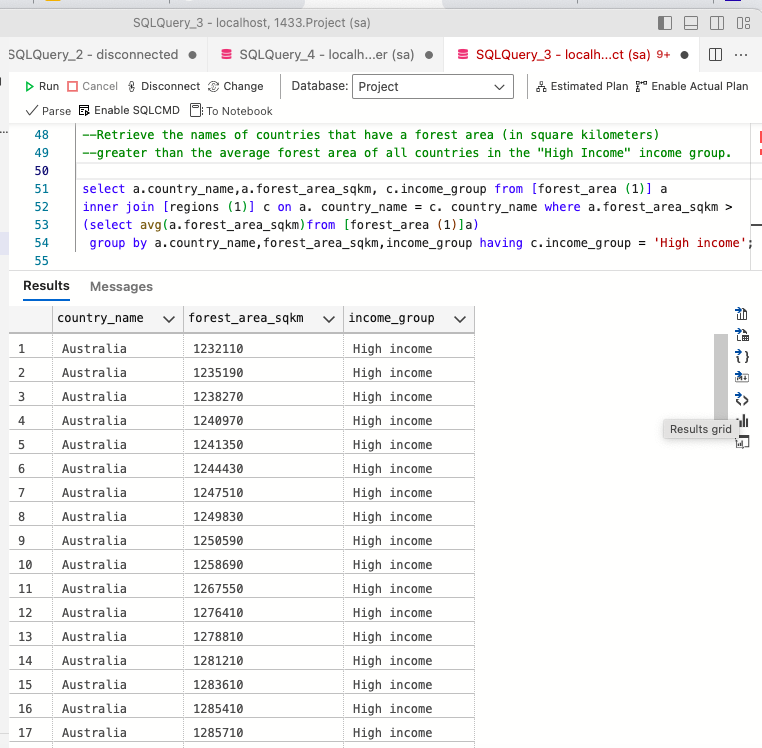

# SQL-Analysis-on-Countries-and-Land-Area

## INTRODUCTION
The purpose of this analysis is to querry 3 different sources of data, to solve and make meaning to the tables where these data are contained. Most of the analysis will involve joining the tables, before doing further analysis.

## PROBLEM STATEMENT

- Find the total number of countries involved in deforestation. 

- Show the income groups of countries having total area ranging from 75,000 to 150,000?

- Retrieve the names of countries that have a forest area (in square kilometers) greater than the average forest area of all countries in the "High Income" income group.

- Calculate the average total area (in square miles) for countries in the "Upper Middle Income" income group?.compare the result with the rest of the income categories.
  Hint: calculate average total areas for the 3 other categories
 
- Determine the total forest area (in square kilometers) for countries in the "High Income" income group? Also compare with the other income categories. 

- What are the countries from each region or continent having the highest total forest area??

## SOLUTION
To solve this problem, first we create a database called **PROJECT**, then import our tables.

To find the total number of countries involved in deforestation, i wrote a query to return countries with forest area as 0

To get the income groups of countries having total area ranging from 75,000 to 150,000?

For question 3, see query and table below 

